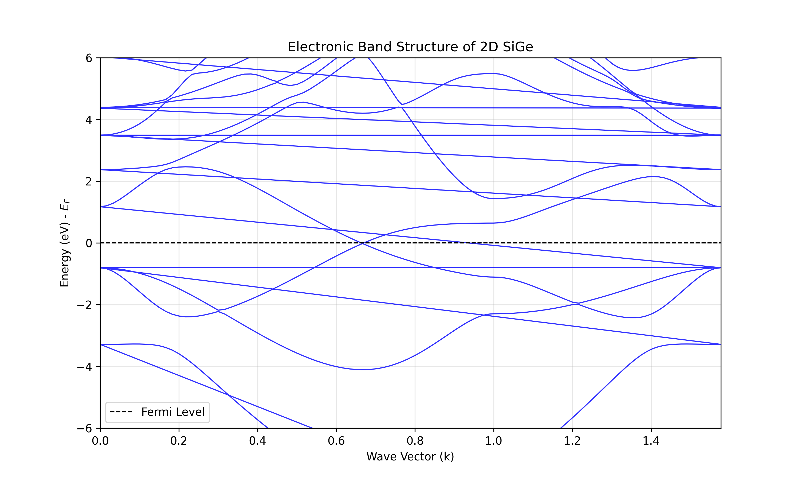
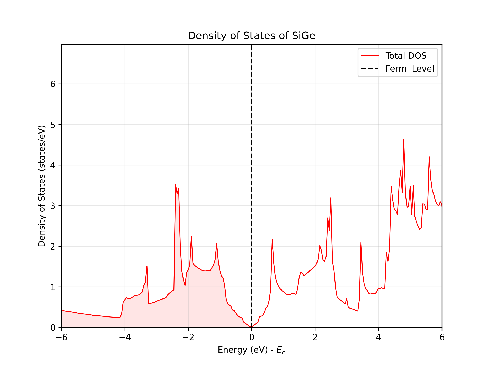

# Electronic Structure of 2D SiGe (Silicene-Germanene)

## 📌 Overview
This project performs a first-principles study of the electronic properties of a two-dimensional SiGe (silicene-germanene) monolayer using **Density Functional Theory (DFT)**.

The calculations demonstrate that 2D SiGe is a **Dirac semimetal** with a buckled honeycomb structure.

## 🛠️ Tools & Methodology
* **Software:** Quantum ESPRESSO (v7.3 via Conda)
* **Environment:** Linux (Ubuntu 24.04 on VMware)
* **Pseudopotentials:** Norm-Conserving (PBE) from PseudoDojo
* **Post-processing:** Python (Matplotlib, NumPy) for data visualization

## 🔬 Key Results

### 1. Geometry Optimization
* Calculated lattice parameter: **$a \approx 3.939$ Å**.
* Confirmed **buckling effect**: Si and Ge atoms are displaced vertically ($\Delta z \approx 0.6$ Å).

### 2. Band Structure
The band structure calculation reveals a linear dispersion relation at the K-point (Fermi level), forming a characteristic **Dirac Cone**. This confirms the semimetallic nature of the material.

### 3. Density of States (DOS)
The DOS calculation shows a V-shaped minimum at the Fermi energy ($E_F = 0$ eV), consistent with the Dirac cone observed in the band structure.

## 📂 Project Structure
* `*.in`: Input files for Quantum ESPRESSO (scf, bands, nscf).
* `*.py`: Python scripts for plotting graphs.
* `*.upf`: Pseudopotentials used.

---
*Project completed as part of a university research practice.*
